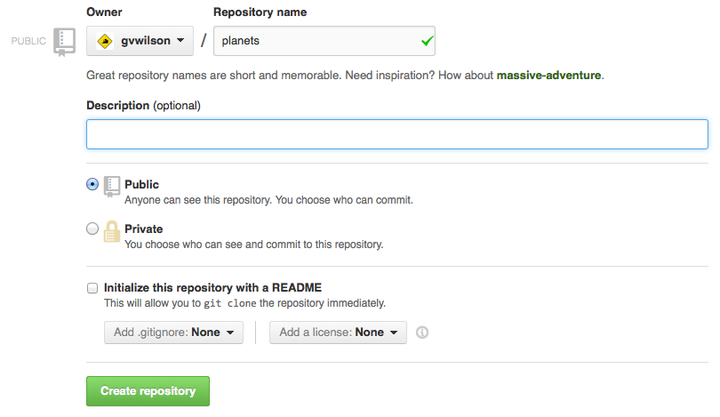
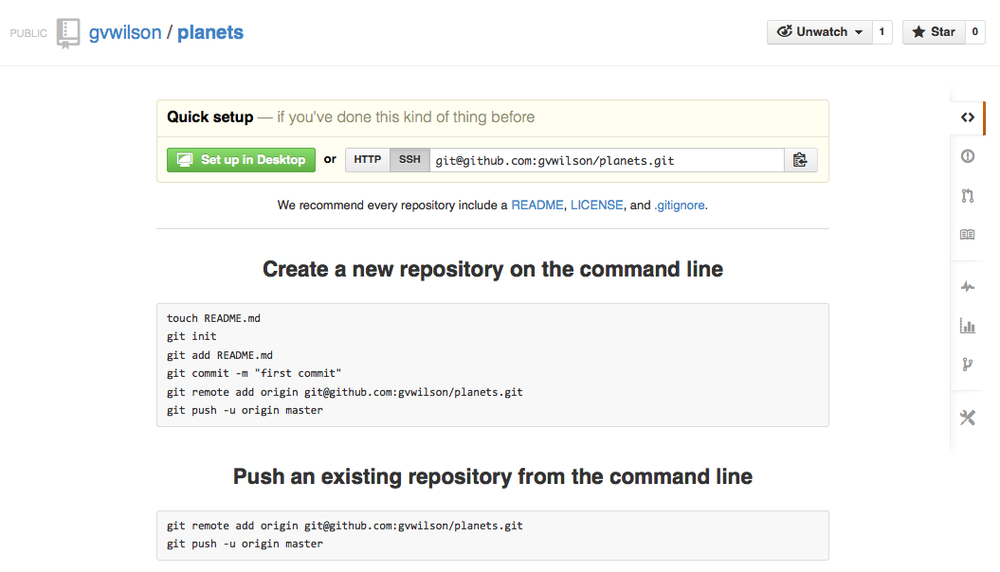
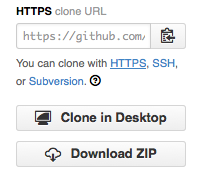

> ## Learning Objectives {.objectives}
>
> *   Explain what remote repositories are and why they are useful.
> *   Explain what happens when a remote repository is cloned.
> *   Explain what happens when changes are pushed to or pulled from a remote repository.

Version control really comes into its own
when we begin to collaborate with other people.
We already have most of the machinery we need to do this;
the only thing missing is to copy changes from one repository to another.

Systems like Git allow us to move work between any two repositories. Remember, from Git's perspective, the two repositories are copies of each other (clones) which may be out of sync, but were once originally made from the same base repository. From the user's perspective, her own copy is the _local_ copy, and any other ones are _remote_ repositories.

A service like Github acts as a central server for your repository, but it is basically just storing another copy of your repository. Github's copies are only special because we told Git that the Github version is special.

So, if a user wants to make changes to a file in a repo that is under Git control, she can make changes to her own copy of the file and then tell Git to commit those changes in its  history. It saves the changes in her own copy of the repo on her own computer.

If she wants another user to see her changes, though, she needs to tell that other user's Git copy that she made changes. This is called _pushing_ the commits to another repo. She can either push the changes directly to another user's copy, or she can push them to a centrally-designated remote repository, like one at Github.

Retrieving the changes from a different copy of the repository is called _pulling_.

Let's start by sharing the changes we've made to our current project with the world.
Log in to GitHub,
then click on the icon in the top right corner to create a new repository called `planets`:

Name your repository "planets" and then click "Create Repository":

As soon as the repository is created,
GitHub displays a page with a URL and some information on how to configure your local repository:

This effectively does the following on GitHub's servers:

~~~ {.bash}
$ mkdir planets
$ cd planets
$ git init
~~~

We want the Github repository to reflect the contents of our local repository, so we have to connect the two repositories. We do this by making the GitHub repository a [remote](reference.html#remote) for the local repository.

Right now, the Github repository is just an empty repo with nothing in it. We want to tell Git where it is and that we want it to be synchronized with our local repo.

The home page of the repository on GitHub includes the URL we need to identify it:

Click on the 'HTTPS' link to change the [protocol](reference.html#protocol) from SSH to HTTPS.

Copy that URL from the browser.
Now we need to tell Git about this new remote repo. Go into your local `planets` directory
and run this command:

~~~ {.bash}
$ git remote add origin https://github.com/vlad/planets
~~~

Make sure to use the URL for your repository rather than Vlad's. This will tell your local Git repo that we want to add a remote repository at this address that is going to be a copy of our repo. By convention, the main remote repository is called `origin`, but you can name a remote anything you want. It's best to have a designated `origin` remote, though.

We can check that the command has worked by running `git remote -v`:

~~~ {.bash}
$ git remote -v
~~~
~~~ {.output}
origin   https://github.com/vlad/planets.git (push)
origin   https://github.com/vlad/planets.git (fetch)
~~~

Remember: we haven't actually put anything in that remote repository yet.

So far, we've only told our local Git repository where the remote one is located. So let's push our local repo to the remote `origin`:

~~~ {.bash}
$ git push origin master
~~~
~~~ {.output}
Counting objects: 9, done.
Delta compression using up to 4 threads.
Compressing objects: 100% (6/6), done.
Writing objects: 100% (9/9), 821 bytes, done.
Total 9 (delta 2), reused 0 (delta 0)
To https://github.com/vlad/planets
 * [new branch]      master -> master
Branch master set up to track remote branch master from origin.
~~~

> ## What is branch master? {.callout}
>
> We could certainly use Git with just SHAs as our labels for our work, and ask Git what label went with which commit went with which set. But this isn't really the way we usually work, is it?
>
> Usually you're trying to accomplish a particular task and you know you're going to make some changes to the repository to achieve this. It'd be nice to have a human-readable label for those changes, to make it easier to visualize and to make it easier to share with others. Branches let us achieve this.
>
> Think of the SHAs as our trail of breadcrumbs that we are leaving behind us as we work. When we make a branch, we are changing to a different type of breadcrumb: maybe we start dropping pieces of pumpernickel behind us instead of sourdough.
>
> When you start your new branch `pumpernickel`, you keep the trail of commits that you made before you branched, but any new commits you make will be using the pumpernickel crumbs.
>
> 
>
> The original trail of breadcrumbs, the sourdough ones in this analogy, have the default branch name of `master`. All new repos start out on a branch named `master`. It's a good practice to keep `master` as the base branch of all the work you do in a repository, and make new branches to do work on new subprojects.

Our local and remote repositories are now in this state:

We can pull changes from the remote repository to the local one as well:

~~~ {.bash}
$ git pull origin master
~~~
~~~ {.output}
From https://github.com/vlad/planets
 * branch            master     -> FETCH_HEAD
Already up-to-date.
~~~

Pulling has no effect in this case
because the two repositories are already synchronized.
If someone else had pushed some changes to the repository on GitHub,
though,
this command would download them to our local repository.

For the next step, get into pairs.
Pick one of your repositories on GitHub to use for collaboration.

The partner whose repository is being used needs to give the other person access.
On GitHub, click the settings button on the right,
then select Collaborators, and enter your partner's username.

The other partner should `cd` to another directory
(so `ls` doesn't show a `planets` folder),
and then make a copy of this repository on your own computer:

~~~ {.bash}
$ git clone https://github.com/vlad/planets.git
~~~

Replace 'vlad' with your partner's username (the one who owns the repository).

`git clone` creates a copy of a repository.

The new collaborator can now make a change in their copy of the repository:

~~~ {.bash}
$ cd planets
$ nano pluto.txt
$ cat pluto.txt
~~~
~~~ {.output}
It is so a planet!
~~~
~~~ {.bash}
$ git add pluto.txt
$ git commit -m "Some notes about Pluto"
~~~
~~~ {.output}
 1 file changed, 1 insertion(+)
 create mode 100644 pluto.txt
~~~

then push the change to GitHub:

~~~ {.bash}
$ git push origin master
~~~
~~~ {.output}
Counting objects: 4, done.
Delta compression using up to 4 threads.
Compressing objects: 100% (2/2), done.
Writing objects: 100% (3/3), 306 bytes, done.
Total 3 (delta 0), reused 0 (delta 0)
To https://github.com/vlad/planets.git
   9272da5..29aba7c  master -> master
~~~

Note that we didn't have to create a remote called `origin`:
Git does this automatically,
using that name,
when we clone a repository.
(This is why `origin` was a sensible choice earlier
when we were setting up remotes by hand.)

We can now download changes into the original repository on our machine:

~~~ {.bash}
$ git pull origin master
~~~
~~~ {.output}
remote: Counting objects: 4, done.
remote: Compressing objects: 100% (2/2), done.
remote: Total 3 (delta 0), reused 3 (delta 0)
Unpacking objects: 100% (3/3), done.
From https://github.com/vlad/planets
 * branch            master     -> FETCH_HEAD
Updating 9272da5..29aba7c
Fast-forward
 pluto.txt | 1 +
 1 file changed, 1 insertion(+)
 create mode 100644 pluto.txt
~~~

> ## GitHub Timestamp {.challenge}
>
> Create a repository on GitHub,
> clone it,
> add a file,
> push those changes to GitHub,
> and then look at the [timestamp](reference.html#timestamp) of the change on GitHub.
> How does GitHub record times, and why?
