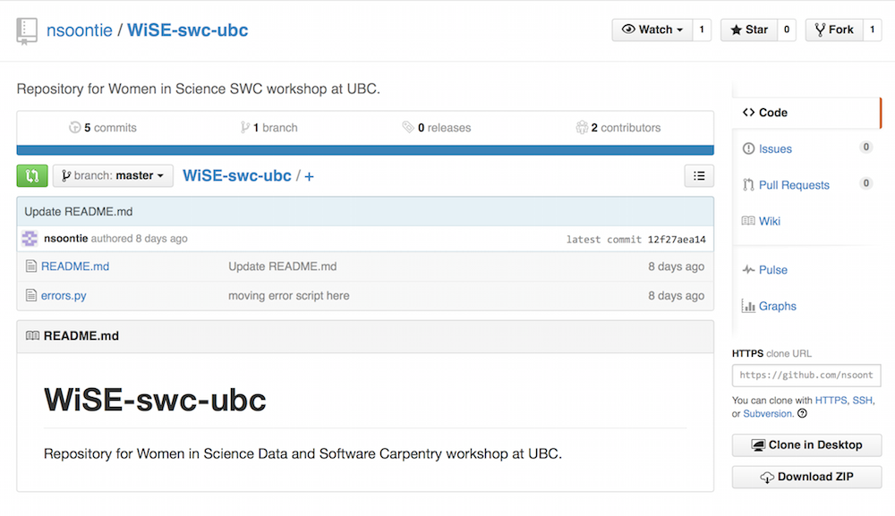
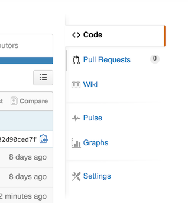
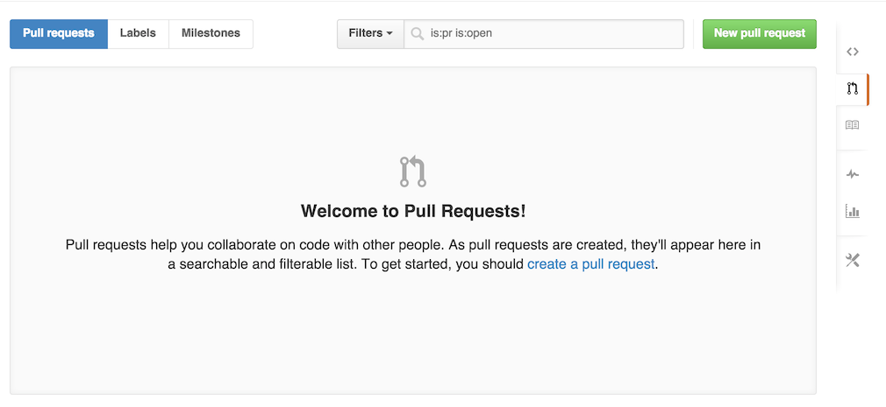
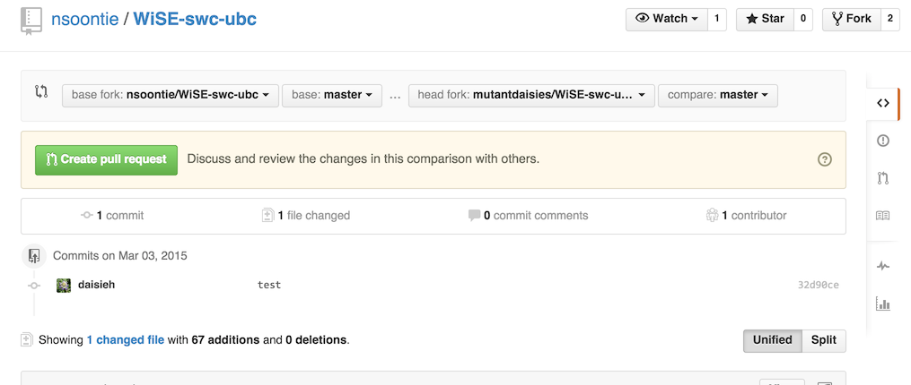
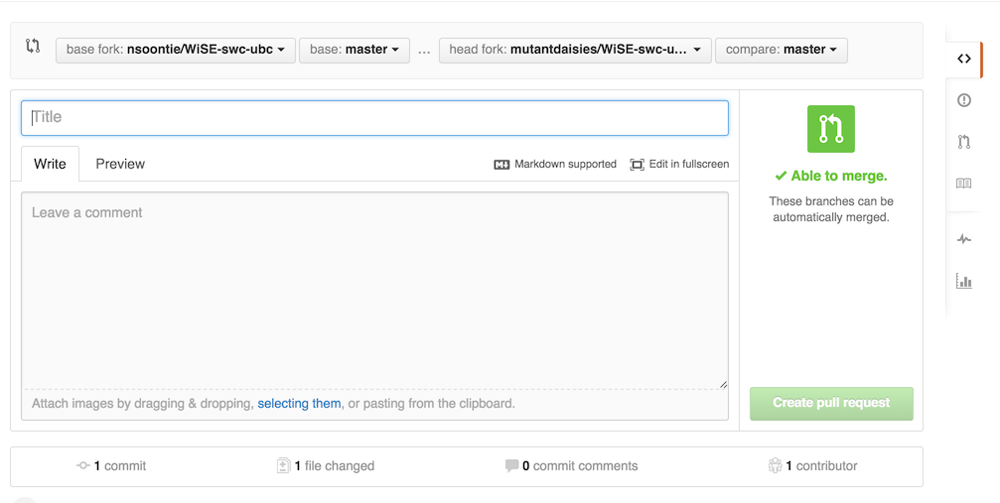
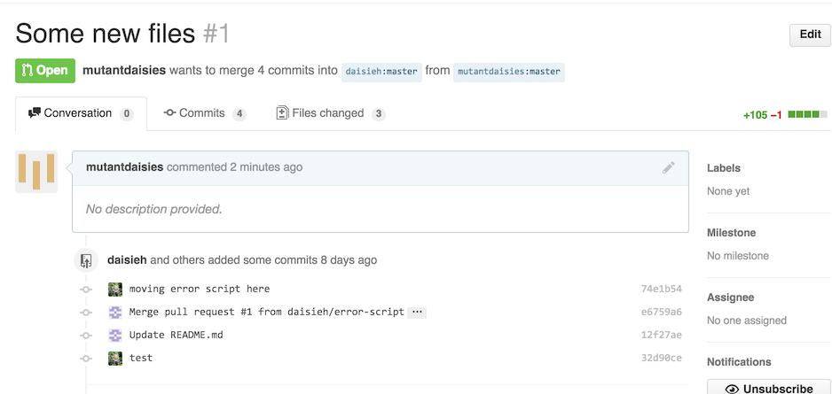

> ## Learning Objectives {.objectives}
>
> * Learn about forks at Github
> * Make pull requests at Github
> * Debug a python script

## Forks, or copies of copies of repos

As you probably noticed from the last Git lesson, it is not a great practice to have multiple collaborators pushing things into the same repo's master branch all the time. If many people are working on the same file, it's pretty much a guaranteed way to lead to conflicts that you then have to resolve.

Remember at the beginning of the session, when Andrew made a repository of the R lessons to share with the class? We're going to look at how to add our own files to his repository when we can't ask someone to allow us to directly collaborate on their repo.

The tool that Github uses to make this easier is called "forking". This is Github-speak for "clone this repo on the Github server." When you fork a repo on Github, it clones the repo into your own user account on Github. This way you can push and pull changes to your own copy without affecting the original owner's copy.

Let's try this now: We're going to fork Andrew's repo. Go to the Github site: `https://github.com/nsoontie/WiSE-swc-ubc`

When you do this, you'll see it do a cute little forking image and then redirect you to your forked copy of the repo. Notice that instead of Nancy's username `nsoontie`, it has your username in the path.

Now you can clone this repo onto your own computer.

If you look at the remote settings for this new clone, you should see that its `origin` is your Github forked repo. It keeps the original repo you forked from as a remote as well.

~~~{.bash}
$ git remote -v
~~~
~~~{.output}
nsoontie	https://github.com/nsoontie/WiSE-swc-ubc.git (fetch)
nsoontie	https://github.com/nsoontie/WiSE-swc-ubc.git (push)
origin	https://github.com/daisieh/WiSE-swc-ubc.git (fetch)
origin	https://github.com/daisieh/WiSE-swc-ubc.git (push)
~~~

Once you've cloned a local copy of the repo to your machine, go to that directory. Let's upload the work we've done in the workshop into this repo.

Now commit and push those files to your fork at Github. Go back to your Github repo page in your web browser and refresh: you should see the files you just pushed in the listing.

Let's say you want to share your work with the rest of the class. Github's way of doing that is through pull requests. Click on that in the right sidebar.

Now, let's create a new pull request.

When you press the big green button, you will go to a page that lists the changes that Github knows about that are different between your fork and the base repo.

Look through these changes and then create the pull request. You'll see that you can add comments and discussions to the pull request.

Create the pull request.

After you've made your pull request, go back to the pull request list for `https://github.com/nsoontie/WiSE-swc-ubc`. You should see everyone's pull requests there now.

Optional: Another instructor has added a pull request to be merged into the main repo. We'll go ahead and merge it. Then, if you want to add these materials back to your own fork, you need to use git pull to pull from Andrew's repo again. This won't be origin, but a different remote with a different address.

Set up another remote, by convention called `upstream`.
~~~{.bash}
$ git remote add upstream https://github.com/nsoontie/WiSE-swc-ubc.git
$ git remote -v
~~~
~~~{.output}
upstream	https://github.com/nsoontie/WiSE-swc-ubc.git (fetch)
upstream	https://github.com/nsoontie/WiSE-swc-ubc.git (push)
origin	https://github.com/daisieh/WiSE-swc-ubc.git (fetch)
origin	https://github.com/daisieh/WiSE-swc-ubc.git (push)
~~~

Now we can pull changes from that remote in the same way we pulled ones from `origin`:
~~~{.bash}
$ git pull upstream master
~~~

